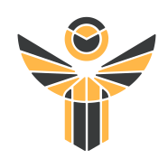
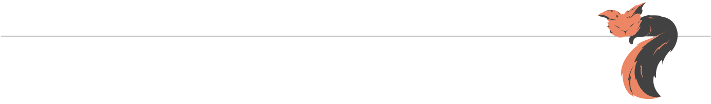

<h2><b>I'm SMR</b></h2>
<i>A QML/C++ programmer.</i>  
<h3>A Life Story</h3>
I'm working on a collection of various QML styles,
most of which make use of OpenGL Shaders.
There aren't that many right now, but I'm attempting to impalement more of them. 
<a href="https://github.com/0smr/neumorphism">Neumorphism</a>,
<a href="https://github.com/0smr/snow-white">Snow White</a>,
<a href="https://github.com/0smr/qooey">Qooey</a>,
<a href="https://github.com/0smr/qube">Qube</a>,
<a href="https://github.com/0smr/glitch">Glitch</a>,
<a href="https://github.com/0smr/hive">Hive</a> 
(This is a list of almost everything I've done so far)
  
Applications 
<a href="https://github.com/0smr/knight-pen">
 Knight Pen</a>,
<a href="https://github.com/0smr/qloudy">
 Qloudy</a>,
<a href="https://github.com/cardianco/cardian">
 Cardian</a>,  
Helpers 
<a href="https://github.com/0smr/icon-manager">
 Icon Manager</a>,
<a href="https://github.com/0smr/qomponent">Qomponent</a>,
<a href="https://github.com/0smr/veqtor">Veqtor</a> 
(these repositories are only intended to be used as submodules)
  
Web stuff 
<a href="https://0smr.github.io">0smr.github.io</a>,
<a href="https://qcpc.github.io">qcpc.github.io</a>
  
Design Story 
I wouldn't call myself a designer, but I have created few designs. 
On <a href="https://www.instagram.com/one.red.little.fish">this</a>
Instagram page, I've collected some of my works.

<h3>Contact Me</h3>
If you want to contact me, you may send me an Email or a Telegram message. 
<a href="mailto:97smr0@gmail.com">Gmail</a>,
<a href="s_m_r0.t.me">Telegram</a>,
<a href="https://0smr.github.io#contactMe">etc</a>.

